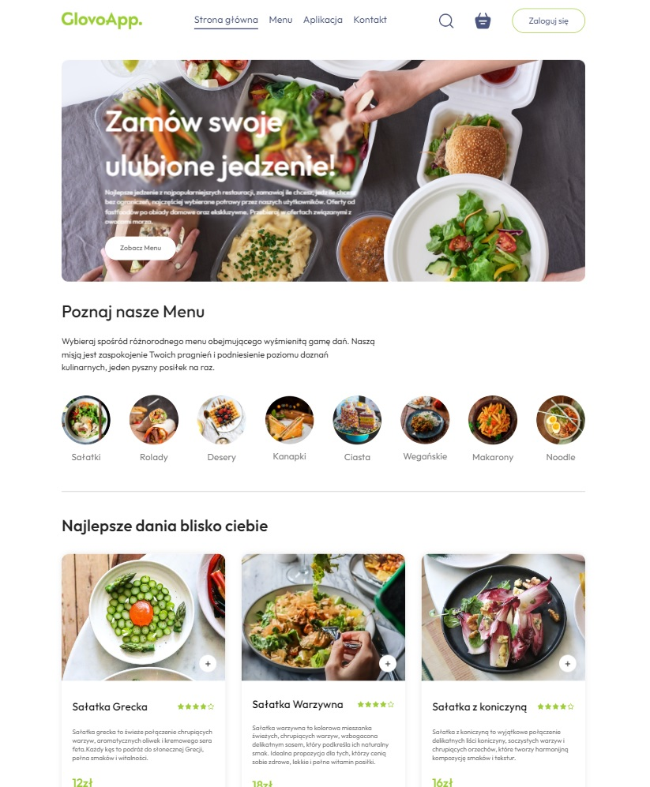

# Projekt GlovoReact

> Aplikacja Delivery na pracownię programowania, 
> testowania i dokumentowania zaawansowanych aplikacji webowych



## Technologie


## Uruchomienie projektu

Aby uruchomić ten projekt, wpisz:
```bash
  cd frontend
  npm run dev
```

## Autorzy

- [@AlexanderAlSughari](https://www.github.com/AlexanderAlSughari)
- [@KacperKropacz](https://www.github.com/KacperKropacz)
- [@SaraZaskorska](https://www.github.com/SaraZaskorska)
- [@jajdys](https://www.github.com/jajdys)